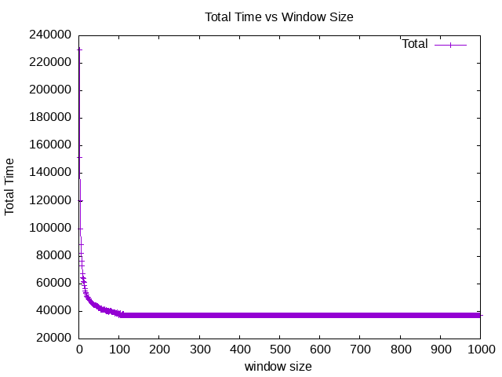

# File-Disks

According to `Readme.md` file, I have the basic assumptions:

1. Initially, the disk header is on sector 6
2. the rotational speed is by default set to 1 degree per time unit. each sector takes up 30 degrees of the rational space
3. Although no explicit seek time, but it still need about 40 time unit to reach middle track from outer track
4. Actually, it will take 30 time unit to transfer data under the above assumption

And the time for `IO` can be calculated by using the following formula:

$$
T_{IO} = T_{seek} + T_{rotation} + T_{transfer}
$$

### Q1

| Argument       | T_seek | T_rotation | T_transfer | T_total |
| -------------- | ------ | ---------- | ---------- | ------- |
| -a 0           | 0      | 165        | 30         | 195     |
| -a 6           | 0      | 345        | 30         | 375     |
| -a 30          | 80     | 265        | 30         | 375     |
| -a 7,30,8      | 160    | 545        | 90         | 795     |
| -a 10,11,12,13 | 40     | 425        | 120        | 585     |


Easy to verify my answer:
```shell
python disk.py -c -a 0 | tail -n 2
python disk.py -c -a 6 | tail -n 2
python disk.py -c -a 30 | tail -n 2
python disk.py -c -a 7,30,8 | tail -n 2
python disk.py -c -a 10,11,12,13 | tail -n 2
```
It will have the following output:
```shell
❯ ./Q1.sh 
-a 0: Seek:  0  Rotate:165  Transfer: 30  Total: 195
-a 6: Seek:  0  Rotate:345  Transfer: 30  Total: 375
-a 30: Seek: 80  Rotate:265  Transfer: 30  Total: 375
-a 7,30,8: Seek:160  Rotate:545  Transfer: 90  Total: 795
-a 10,11,12,13: Seek: 40  Rotate:425  Transfer:120  Total: 585
```

### Q2

right now, change the seek rate to `[2, 4, 8, 10, 40]` and final `0.1` by using the `Q2.sh`(details in file)
```shell
❯ ./Q2.sh 
-S 2 -a 0: Seek:  0  Rotate:165  Transfer: 30  Total: 195
-S 4 -a 0: Seek:  0  Rotate:165  Transfer: 30  Total: 195
-S 8 -a 0: Seek:  0  Rotate:165  Transfer: 30  Total: 195
-S 10 -a 0: Seek:  0  Rotate:165  Transfer: 30  Total: 195
-S 40 -a 0: Seek:  0  Rotate:165  Transfer: 30  Total: 195
-S 0.1 -a 0: Seek:  0  Rotate:165  Transfer: 30  Total: 195
-S 2 -a 6: Seek:  0  Rotate:345  Transfer: 30  Total: 375
-S 4 -a 6: Seek:  0  Rotate:345  Transfer: 30  Total: 375
-S 8 -a 6: Seek:  0  Rotate:345  Transfer: 30  Total: 375
-S 10 -a 6: Seek:  0  Rotate:345  Transfer: 30  Total: 375
-S 40 -a 6: Seek:  0  Rotate:345  Transfer: 30  Total: 375
-S 0.1 -a 6: Seek:  0  Rotate:345  Transfer: 30  Total: 375
-S 2 -a 30: Seek: 40  Rotate:305  Transfer: 30  Total: 375
-S 4 -a 30: Seek: 20  Rotate:325  Transfer: 30  Total: 375
-S 8 -a 30: Seek: 10  Rotate:335  Transfer: 30  Total: 375
-S 10 -a 30: Seek:  8  Rotate:337  Transfer: 30  Total: 375
-S 40 -a 30: Seek:  2  Rotate:343  Transfer: 30  Total: 375
-S 0.1 -a 30: Seek:801  Rotate:264  Transfer: 30  Total:1095
-S 2 -a 7,30,8: Seek: 80  Rotate:625  Transfer: 90  Total: 795
-S 4 -a 7,30,8: Seek: 40  Rotate:305  Transfer: 90  Total: 435
-S 8 -a 7,30,8: Seek: 20  Rotate:325  Transfer: 90  Total: 435
-S 10 -a 7,30,8: Seek: 16  Rotate:329  Transfer: 90  Total: 435
-S 40 -a 7,30,8: Seek:  4  Rotate:341  Transfer: 90  Total: 435
-S 0.1 -a 7,30,8: Seek:1602  Rotate:543  Transfer: 90  Total:2235
-S 2 -a 10,11,12,13: Seek: 20  Rotate:445  Transfer:120  Total: 585
-S 4 -a 10,11,12,13: Seek: 10  Rotate:455  Transfer:120  Total: 585
-S 8 -a 10,11,12,13: Seek:  5  Rotate:460  Transfer:120  Total: 585
-S 10 -a 10,11,12,13: Seek:  4  Rotate:461  Transfer:120  Total: 585
-S 40 -a 10,11,12,13: Seek:  1  Rotate:464  Transfer:120  Total: 585
-S 0.1 -a 10,11,12,13: Seek:401  Rotate:424  Transfer:120  Total: 945
```
Apparently, although **Seek Rate** has improved a lot compared to 1, 
the total time does not change a lot. 
Since the whole path to shift is not changed, 
which is determined by **Rotate Speed**.
But If **Seek Rate** is less than `1.0`, things get changed, It will consume
too much time on seek process, Only when the disk header is completely on 
the target track, it can be regarded as valid. So it will takes too much time
to make sure its header already on that track.

### Q3

The same framework we have finished above, but replace `-S` with `-R` in `Q3.sh`
```shell
-R 0.1 -a 0: Seek:  0  Rotate:1650  Transfer:300  Total:1950
-R 0.5 -a 0: Seek:  0  Rotate:330  Transfer: 60  Total: 390
-R 0.01 -a 0: Seek:  0  Rotate:16500  Transfer:3000  Total:19500
-R 0.1 -a 6: Seek:  0  Rotate:3449  Transfer:301  Total:3750
-R 0.5 -a 6: Seek:  0  Rotate:690  Transfer: 60  Total: 750
-R 0.01 -a 6: Seek:  0  Rotate:34500  Transfer:3001  Total:37501
-R 0.1 -a 30: Seek: 80  Rotate:3369  Transfer:301  Total:3750
-R 0.5 -a 30: Seek: 80  Rotate:610  Transfer: 60  Total: 750
-R 0.01 -a 30: Seek: 80  Rotate:34420  Transfer:3001  Total:37501
-R 0.1 -a 7,30,8: Seek:160  Rotate:3289  Transfer:900  Total:4349
-R 0.5 -a 7,30,8: Seek:160  Rotate:1250  Transfer:180  Total:1590
-R 0.01 -a 7,30,8: Seek:160  Rotate:34340  Transfer:9000  Total:43500
-R 0.1 -a 10,11,12,13: Seek: 40  Rotate:4610  Transfer:1200  Total:5850
-R 0.5 -a 10,11,12,13: Seek: 40  Rotate:890  Transfer:240  Total:1170
-R 0.01 -a 10,11,12,13: Seek: 40  Rotate:46460  Transfer:12001  Total:58501
```
Things change again! For this time, `Seek time` stays the same as `Q1` part, 
but rotation time has increased to multiple times, after specific observation,
we can say that $Time_{after} = Time_{before} / R_{rotation}$. 

### Q4
Consider arguments with `-a 7,30,8` with different scheduling policy as follow:
```shell
❯ python disk.py -c  -a 7,30,8 | tail -n 6
Block:   7  Seek:  0  Rotate: 15  Transfer: 30  Total:  45
Block:  30  Seek: 80  Rotate:220  Transfer: 30  Total: 330
Block:   8  Seek: 80  Rotate:310  Transfer: 30  Total: 420

TOTALS      Seek:160  Rotate:545  Transfer: 90  Total: 795
❯ python disk.py -c -p SSTF -a 7,30,8 | tail -n 6
Block:   7  Seek:  0  Rotate: 15  Transfer: 30  Total:  45
Block:   8  Seek:  0  Rotate:  0  Transfer: 30  Total:  30
Block:  30  Seek: 80  Rotate:190  Transfer: 30  Total: 300

TOTALS      Seek: 80  Rotate:205  Transfer: 90  Total: 375
```
Acoording to the above outcomes, the order of *FIFO* policy is `7, 30, 8`, while 
under *SSTF* policy, the order is `7, 8, 30` and it will take $80$ time to seek,
$205$ time unit to rotate and $90$ time unit to transfer.

### Q5
Under the shortest access-time first(SATF) policy, using `disk.py` with argument `-p SATF`
```shell
❯ python disk.py -c -p SATF -a 7,30,8 | tail -n 6
Block:   7  Seek:  0  Rotate: 15  Transfer: 30  Total:  45
Block:   8  Seek:  0  Rotate:  0  Transfer: 30  Total:  30
Block:  30  Seek: 80  Rotate:190  Transfer: 30  Total: 300

TOTALS      Seek: 80  Rotate:205  Transfer: 90  Total: 375
```
For this request stream, there is no difference. But actually 
```shell
❯ python disk.py -c -p SATF -a 0,21 | tail -n 6

Block:  21  Seek: 40  Rotate: 35  Transfer: 30  Total: 105
Block:   0  Seek: 40  Rotate: 20  Transfer: 30  Total:  90

TOTALS      Seek: 80  Rotate: 55  Transfer: 60  Total: 195
❯ python disk.py -c -p SSTF -a 0,21 | tail -n 6

Block:   0  Seek:  0  Rotate:165  Transfer: 30  Total: 195
Block:  21  Seek: 40  Rotate:200  Transfer: 30  Total: 270

TOTALS      Seek: 40  Rotate:365  Transfer: 60  Total: 465
```
when total seek time is shorter than rotate time, SATF will be better than SSTF

### Q6
Using the FIFO policy to resolve request stream `-a 10,11,12,13`, it will output 
```shell
❯ python disk.py -c -a 10,11,12,13 | tail -n 8

Block:  10  Seek:  0  Rotate:105  Transfer: 30  Total: 135
Block:  11  Seek:  0  Rotate:  0  Transfer: 30  Total:  30
Block:  12  Seek: 40  Rotate:320  Transfer: 30  Total: 390
Block:  13  Seek:  0  Rotate:  0  Transfer: 30  Total:  30

TOTALS      Seek: 40  Rotate:425  Transfer:120  Total: 585
```
when `skew = 2` or `skew = 14`, it will have the maximize performance:
```shell
❯ python disk.py -c -a 10,11,12,13 -o 2 | tail -n 8

Block:  10  Seek:  0  Rotate:105  Transfer: 30  Total: 135
Block:  11  Seek:  0  Rotate:  0  Transfer: 30  Total:  30
Block:  12  Seek: 40  Rotate: 20  Transfer: 30  Total:  90
Block:  13  Seek:  0  Rotate:  0  Transfer: 30  Total:  30

TOTALS      Seek: 40  Rotate:125  Transfer:120  Total: 285
```
For `-S 2`, the optimal skew is $1$, and for `-S 4`, the optiaml skew is $1$ as well.
```shell
❯ python disk.py -c -S 2 -a 10,11,12,13 -o 1 | tail -n 8

Block:  10  Seek:  0  Rotate:105  Transfer: 30  Total: 135
Block:  11  Seek:  0  Rotate:  0  Transfer: 30  Total:  30
Block:  12  Seek: 20  Rotate: 10  Transfer: 30  Total:  60
Block:  13  Seek:  0  Rotate:  0  Transfer: 30  Total:  30

TOTALS      Seek: 20  Rotate:115  Transfer:120  Total: 255
❯ python disk.py -c -S 4 -a 10,11,12,13 -o 1 | tail -n 8

Block:  10  Seek:  0  Rotate:105  Transfer: 30  Total: 135
Block:  11  Seek:  0  Rotate:  0  Transfer: 30  Total:  30
Block:  12  Seek: 10  Rotate: 20  Transfer: 30  Total:  60
Block:  13  Seek:  0  Rotate:  0  Transfer: 30  Total:  30

TOTALS      Seek: 10  Rotate:125  Transfer:120  Total: 255
```
the formula for calculating skew is 
$$
skew = \left\lceil \left( \frac{\text{track-distance}}{\text{seek-speed}} \right) \cdot \frac{\text{rotation-speed}}{\text{rotational-space-degrees}} \right\rceil
$$

For current occasion, $track-distance$ is $40$, while $rotational-space-degress$ is $360/12=30$, so the final answer is $skew = Ceil(40 / 1 * 1 / 30) = 2 $, same rules when $S = 2$ and $S = 4$.

### Q7

```shell
❯ ./Q7.sh 
Block:  45  Seek: 40  Rotate:310  Transfer: 20  Total: 370
Block:  40  Seek:  0  Rotate:240  Transfer: 20  Total: 260
Block:  22  Seek: 40  Rotate: 85  Transfer: 10  Total: 135
Block:  13  Seek:  0  Rotate:260  Transfer: 10  Total: 270
Block:  27  Seek:  0  Rotate:130  Transfer: 10  Total: 140

TOTALS      Seek: 80  Rotate:1025  Transfer: 70  Total:1175

Block:  30  Seek:  0  Rotate:115  Transfer: 10  Total: 125
Block:  23  Seek:  0  Rotate:280  Transfer: 10  Total: 290
Block:  31  Seek:  0  Rotate: 70  Transfer: 10  Total:  80
Block:  11  Seek:  0  Rotate:150  Transfer: 10  Total: 160
Block:  43  Seek: 40  Rotate:335  Transfer: 20  Total: 395

TOTALS      Seek: 40  Rotate:950  Transfer: 60  Total:1050

Block:  33  Seek:  0  Rotate:145  Transfer: 10  Total: 155
Block:  40  Seek: 40  Rotate: 55  Transfer: 20  Total: 115
Block:  42  Seek:  0  Rotate: 20  Transfer: 20  Total:  40
Block:  50  Seek:  0  Rotate:140  Transfer: 20  Total: 160
Block:  39  Seek:  0  Rotate:120  Transfer: 20  Total: 140

TOTALS      Seek: 40  Rotate:480  Transfer: 90  Total: 610

Block:  48  Seek: 40  Rotate: 10  Transfer: 20  Total:  70
Block:  37  Seek:  0  Rotate:120  Transfer: 20  Total: 140
Block:  41  Seek:  0  Rotate: 60  Transfer: 20  Total:  80
Block:  48  Seek:  0  Rotate:120  Transfer: 20  Total: 140
Block:  14  Seek: 40  Rotate:205  Transfer: 10  Total: 255

TOTALS      Seek: 80  Rotate:515  Transfer: 90  Total: 685
```
First time with no random seed 
$$
outer: 3 / (135 + 270 + 140) = 0.0055 \\
middle: 2 / (370 + 260) = 0.003175
$$

Second time with seed ($s=10$)
$$
outer: 4 / (125 + 290 + 80 +160) = 0.0061 \\
middle: 1 / 395 = 0.00253
$$

Third time with seed ($s=5$) 
$$
outer: 1 / 155 = 0.00645 \\
middle: 4 / (115 + 40 + 160 + 140) = 0.00879
$$

Fourth time with seed ($s=20$)
$$
outer: 1 / 255 = 0.00392 \\
middle: 4 / (70 + 140 + 80 + 140) = 0.0093
$$

### Q8



According to above figure, created by using `Q8.sh`, As the window size enlarges, total time decreases from sharply to smoothly
Finally, it will limit to a single point whose value is $37215$, and after that, no matter how big the window size is, its value stays.
Take a deep look into the temp file data.txt, we can find the minimum value of w that can lead to $37215$ is $114$, when the random seed is $150$. 

When the window size is restricted to $1$, no matter what policy you choose, the total time will stay.

### Q9
Consider the following request stream `[30, 7, 8, 9, 10, 0, 1, 2, 3]`, it will lead to starvation when using SATF policy
```shell
❯ python disk.py -c -a 30,7,8,9,10,0,1,2,3 -p SATF | tail -n 12
Block:   7  Seek:  0  Rotate: 15  Transfer: 30  Total:  45
Block:   8  Seek:  0  Rotate:  0  Transfer: 30  Total:  30
Block:   9  Seek:  0  Rotate:  0  Transfer: 30  Total:  30
Block:  10  Seek:  0  Rotate:  0  Transfer: 30  Total:  30
Block:   0  Seek:  0  Rotate: 30  Transfer: 30  Total:  60
Block:   1  Seek:  0  Rotate:  0  Transfer: 30  Total:  30
Block:   2  Seek:  0  Rotate:  0  Transfer: 30  Total:  30
Block:   3  Seek:  0  Rotate:  0  Transfer: 30  Total:  30
Block:  30  Seek: 80  Rotate:340  Transfer: 30  Total: 450

TOTALS      Seek: 80  Rotate:385  Transfer:270  Total: 735
```
But when we choose another policy named BSATF as:
```shell
❯ python disk.py -c -a 30,7,8,9,10,0,1,2,3 -p BSATF -w 4 | tail -n 12
Block:   7  Seek:  0  Rotate: 15  Transfer: 30  Total:  45
Block:   8  Seek:  0  Rotate:  0  Transfer: 30  Total:  30
Block:   9  Seek:  0  Rotate:  0  Transfer: 30  Total:  30
Block:  30  Seek: 80  Rotate:160  Transfer: 30  Total: 270
Block:  10  Seek: 80  Rotate: 10  Transfer: 30  Total: 120
Block:   0  Seek:  0  Rotate: 30  Transfer: 30  Total:  60
Block:   1  Seek:  0  Rotate:  0  Transfer: 30  Total:  30
Block:   2  Seek:  0  Rotate:  0  Transfer: 30  Total:  30
Block:   3  Seek:  0  Rotate:  0  Transfer: 30  Total:  30

TOTALS      Seek:160  Rotate:215  Transfer:270  Total: 645
```
yeah, things change, block 30 request is resolved in the first window, it avoids starvation. It is selected to perform just after respond to first 3 block requests. Maybe a disk should introduce the maximum window size to make sure some early coming
block request can fetch data after waiting so long time.

### Q10
```shell
❯ python disk.py -a 9,20 -c | tail -n 5 | head -n 4
Block:   9  Seek:  0  Rotate: 75  Transfer: 30  Total: 105
Block:  20  Seek: 40  Rotate:260  Transfer: 30  Total: 330

TOTALS      Seek: 40  Rotate:335  Transfer: 60  Total: 435

❯ python disk.py -a 9,20 -c -p SATF | tail -n 5 | head -n 4
Block:  20  Seek: 40  Rotate:  5  Transfer: 30  Total:  75
Block:   9  Seek: 40  Rotate:320  Transfer: 30  Total: 390

TOTALS      Seek: 80  Rotate:325  Transfer: 60  Total: 465
```
Apparently, from what we learned in algorithm design course, greedy can only find local minimum, but can not find global minimum. In other words, that's why dynamic programming is existent. But in most cases, greedy is good enough to provide 
extraordinary performance in daily life.